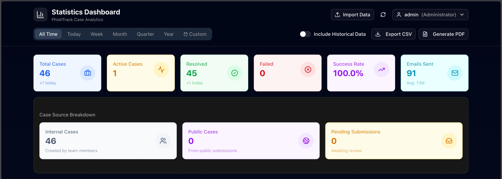
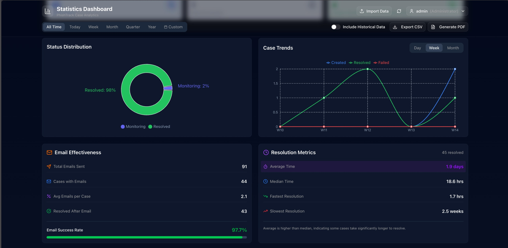
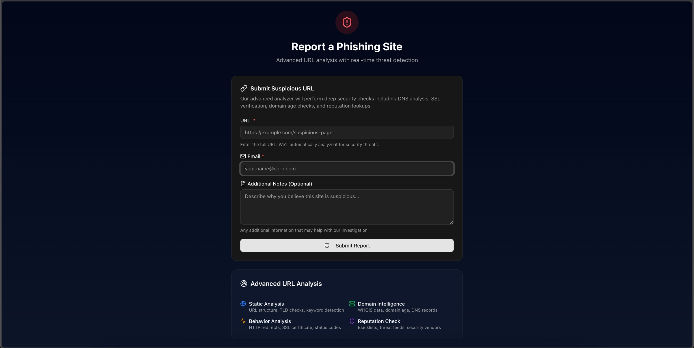
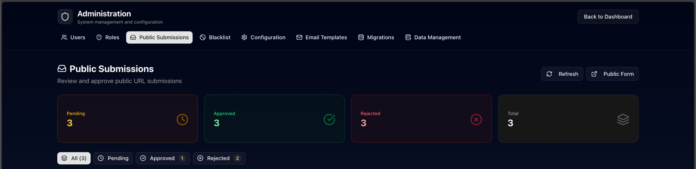
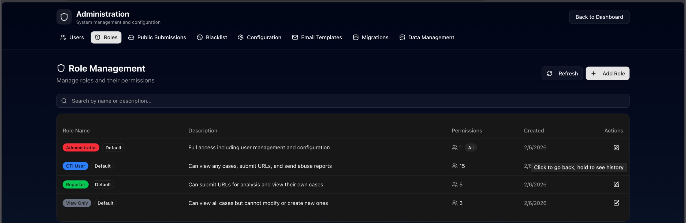

# Rapid Anti-phishing Network Takedown Analysis System (RANTAS)

Rapid Anti-phishing Network Takedown Analysis System (RANTAS) is a phishing detection and reporting platform designed for security teams to track, manage, and respond to phishing threats.

## Features

- **Case Management** - Track phishing cases from submission to resolution
- **Typosquat Detection** - Monitor certificate transparency logs for domains typosquatting your brands
- **Email Reporting** - Send takedown notices via SMTP or Microsoft Graph API
- **XARF Export** - Generate eXtended Abuse Reporting Format reports
- **Dashboard & Analytics** - Visualize phishing trends and response metrics
- **Role-Based Access Control** - Granular permissions for team members

## Screenshots

### Dashboard





### Public Submission





### Role Management



## Quick Start

### Prerequisites

- Docker & Docker Compose
- PostgreSQL 15+
- Redis 7+
- Node.js 20+ (for local frontend development)
- Python 3.10+ (for local backend development)

### Installation

1. **Clone the repository**
   ```bash
   git clone https://github.com/deprito/rantas.git
   cd rantas
   ```

2. **Copy environment files**
   ```bash
   cp env.example .env
   cp backend/env.example backend/.env
   cp frontend/env.example frontend/.env.local
   ```

3. **Configure environment variables**
   
   At minimum, set these variables in `.env`:
   ```bash
   # Database
   POSTGRES_USER=rantas
   POSTGRES_PASSWORD=<generate-secure-password>
   POSTGRES_DB=rantas

   # Security
   SECRET_KEY=<generate-with-openssl-rand-hex-32>
   WEBHOOK_SECRET=<generate-secure-token>
   DEFAULT_ADMIN_PASSWORD=<set-initial-admin-password>
   ```

4. **Start with Docker Compose**
   ```bash
   docker compose up -d
   ```

5. **Access the application**
   - Frontend: http://localhost:3001
   - Backend API: http://localhost:9000
   - Flower (Celery monitoring): http://localhost:5557

### First Login

After initial setup, log in with:
- **Username:** `admin`
- **Password:** The value you set for `DEFAULT_ADMIN_PASSWORD` in `.env`

> **Important:** Change the default admin password immediately after first login.

## Architecture

```
┌─────────────┐     ┌─────────────┐     ┌─────────────┐
│  Frontend   │────▶│   Backend   │────▶│  Database   │
│  (Next.js)  │     │  (FastAPI)  │     │ (PostgreSQL)│
└─────────────┘     └─────────────┘     └─────────────┘
                           │
                           ▼
                    ┌─────────────┐
                    │    Redis    │
                    │  (Celery)   │
                    └─────────────┘
                           │
           ┌───────────────┼───────────────┐
           ▼               ▼               ▼
    ┌──────────┐   ┌──────────┐   ┌──────────┐
    │  Worker  │   │   Beat   │   │  Flower  │
    └──────────┘   └──────────┘   └──────────┘
```

## Configuration

### Environment Variables

See the following files for all available options:

| File | Description |
|------|-------------|
| `env.example` | Root configuration (ports, resource limits) |
| `backend/env.example` | Backend settings (SMTP, Graph API, security) |
| `frontend/env.example` | Frontend settings (API URL, feature flags) |

### Email Configuration

RANTAS supports two methods for sending takedown notices:

**SMTP (traditional):**
```bash
SMTP_ENABLED=true
SMTP_HOST=smtp.gmail.com
SMTP_PORT=587
SMTP_USERNAME=your-email@gmail.com
SMTP_PASSWORD=your-app-password
```

**Microsoft Graph API (Microsoft 365):**
```bash
GRAPH_ENABLED=true
GRAPH_TENANT_ID=<your-tenant-id>
GRAPH_CLIENT_ID=<your-client-id>
GRAPH_CLIENT_SECRET=<your-client-secret>
```

### Typosquat Detection

Configure brands to monitor in `.env`:
```bash
BRAND_IMPACTED=["Example Corp","Test Corp"]
HUNTING_MIN_SCORE=50
HUNTING_ALERT_SCORE=80
```

## Development

### Backend Development

```bash
cd backend
python -m venv venv
source venv/bin/activate  # or `venv\Scripts\activate` on Windows
pip install -r requirements.txt
uvicorn app.main:app --reload
```

### Frontend Development

```bash
cd frontend
npm install
npm run dev
```

### Running Tests

```bash
# Backend tests
cd backend
pytest

# Frontend tests
cd frontend
npm test
```

## Deployment

### Docker Compose (Single Server)

```bash
docker compose -f docker-compose.yml up -d
```

### Portainer (Private Registry)

```bash
# Set your registry host (e.g., ghcr.io/your-org)
export REGISTRY_HOST=ghcr.io/your-org

docker compose -f docker-compose.ghcr.yml up -d
```

See `docker-compose.ghcr.yml` for private registry deployment configuration.

### Building Docker Images

To build and push images to your own registry:

```bash
# Set registry credentials
export REGISTRY_HOST=ghcr.io/your-org
export REGISTRY_USERNAME=your-username
export REGISTRY_PASSWORD=your-token

# Build and push
./scripts/build-ghcr.sh
```

The images will be pushed as:
- `${REGISTRY_HOST}/rantas-backend:latest`
- `${REGISTRY_HOST}/rantas-frontend:latest`

## API Documentation

Once running, access the interactive API docs at:
- Swagger UI: http://localhost:9000/docs
- ReDoc: http://localhost:9000/redoc

## Security

### Reporting Vulnerabilities

Please report security vulnerabilities to [halo@deprito.net](mailto:halo@deprito.net). See [SECURITY.md](SECURITY.md) for details.

### Security Best Practices

1. **Change default passwords** - Always set `DEFAULT_ADMIN_PASSWORD` before deployment
2. **Use HTTPS** - Never deploy without TLS termination in production
3. **Rotate secrets** - Regularly rotate `SECRET_KEY` and `WEBHOOK_SECRET`
4. **Restrict CORS** - Update `CORS_ORIGINS` to your actual domains
5. **Monitor logs** - Enable logging and monitor for suspicious activity

## Contributing

1. Fork the repository
2. Create a feature branch (`git checkout -b feature/amazing-feature`)
3. Commit your changes (`git commit -m 'Add amazing feature'`)
4. Push to the branch (`git push origin feature/amazing-feature`)
5. Open a Pull Request

## License

This project is licensed under the MIT License - see the [LICENSE](LICENSE) file for details.

## Acknowledgments

- Built with [FastAPI](https://fastapi.tiangolo.com/) and [Next.js](https://nextjs.org/)
- Uses [Celery](https://docs.celeryq.dev/) for async task processing
- Typosquat detection inspired by [CertStream](https://certstream.calidosec.com/)

---

**Need Help?** Open an issue on GitHub or contact the development team.
